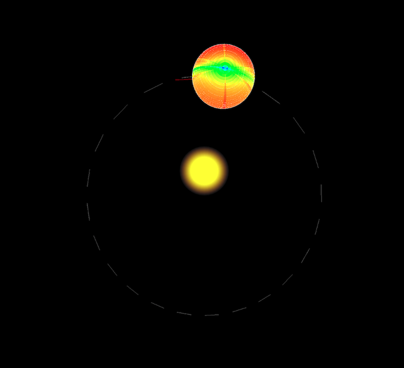

# Sunlit Surface

Visualization of the relative sunlight time over Mercury's surface. Cold colors
represent the spots that received sunlight for a shorter time, warm colors for
a longer time. Mercury has a 3:2 spin-orbit resonance. In consequence, the
surface is evenly lit periodically, except for a band of surface which receives
less light because of the surface roughness (simulated here with a twilight).

The orbit is computed using Kepler's law. A multiplicative inverse function was
used to simulate twilight.

Visualize the full result with animation on [thibautvoirand.com/mercury](https://thibautvoirand.com/mercury)

